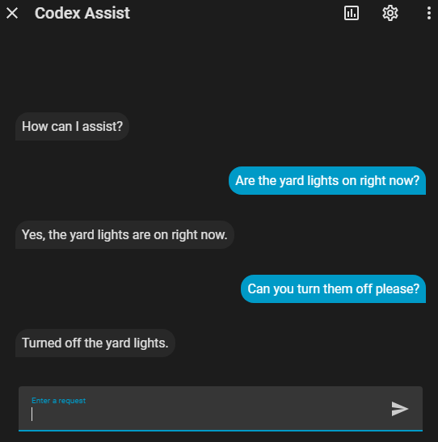
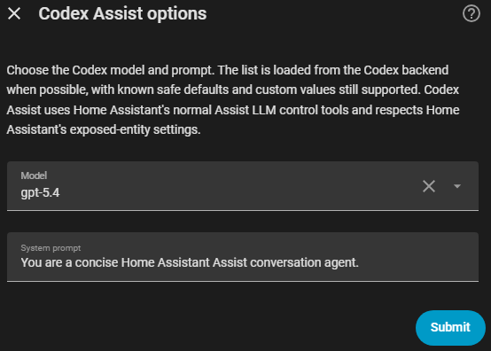

# Codex Assist for Home Assistant

<p align="center">
  
</p>

<p align="center">
  <a href="https://github.com/itsreverence/ha-codex-assist/releases"></a>
  <a href="https://github.com/itsreverence/ha-codex-assist/actions"></a>
  
</p>

Use OpenAI Codex / ChatGPT as a Home Assistant Assist conversation agent.

Codex Assist signs in with Codex-style ChatGPT device-code auth, adds Codex as a selectable Assist conversation agent, and keeps device control inside Home Assistant's normal exposed-entity safety model.

> Experimental: this project is not affiliated with OpenAI or Home Assistant. Codex backend compatibility may change with upstream Codex updates.

## Quick install

Requirements: Home Assistant `2026.5.0` or newer, HACS, and a ChatGPT account/plan with Codex access.

[](https://my.home-assistant.io/redirect/hacs_repository/?owner=itsreverence&repository=ha-codex-assist&category=integration)
[](https://my.home-assistant.io/redirect/config_flow_start/?domain=codex_assist)

1. In Home Assistant, open **HACS → Custom repositories**.
2. Add this repository as an **Integration**:

   ```text
   https://github.com/itsreverence/ha-codex-assist
   ```

3. Install **Codex Assist**.
4. Restart Home Assistant.
5. In ChatGPT, enable **Settings → Security → Enable device code authorization for Codex** if it is available on your account.
6. Go to **Settings → Devices & services → Add integration**, or use the button above.
7. Search for **Codex Assist** and complete device-code sign-in.
8. Select **Codex Assist** in your Assist pipeline.
9. Test with a harmless exposed entity first, like a single light.

## Why use it?

- Use eligible ChatGPT/Codex subscription access instead of wiring Home Assistant to OpenAI API billing.
- Pick Codex as a normal Home Assistant Assist conversation agent.
- Let Home Assistant's Assist exposed-entity controls define what the agent can see or control.
- Ask about exposed entity state and request simple actions in the same Assist chat.
- Stream replies in Assist while Codex is answering.
- Configure model, prompt, reasoning effort, reasoning summary, and text verbosity from the integration options flow.
- On the v0.2 media branch, test native AI Task attachment handling and subscription-backed image generation with curated image quality and size controls.

<p align="center">
  
</p>

<p align="center">
  
</p>

## Safety short version

Codex Assist does **not** expose a raw “call any Home Assistant service” bridge. It routes control through Home Assistant's Assist LLM API, so your **Assist exposed entities** list is the practical safety boundary.

Start with harmless lights or read-only questions. Keep locks, alarms, garage doors, water shutoff valves, covers, and other sensitive devices unexposed unless you deliberately want Assist control there.

## User guide

The GitHub Wiki is the main user manual:

- [Installation](https://github.com/itsreverence/ha-codex-assist/wiki/Installation)
- [Choosing a Model](https://github.com/itsreverence/ha-codex-assist/wiki/Choosing-a-Model)
- [Safe Entity Exposure](https://github.com/itsreverence/ha-codex-assist/wiki/Safe-Entity-Exposure)
- [Troubleshooting](https://github.com/itsreverence/ha-codex-assist/wiki/Troubleshooting)
- [Compatibility and Limitations](https://github.com/itsreverence/ha-codex-assist/wiki/Compatibility-and-Limitations)

## Project docs

Canonical code-tied docs stay in the repository:

- [Security policy](SECURITY.md)
- [Architecture](docs/ARCHITECTURE.md)
- [Development workflow](docs/WORKFLOW.md)

## Development checks

```bash
uv run ruff check .
uv run pytest
```

Current release: `v0.1.10`.
