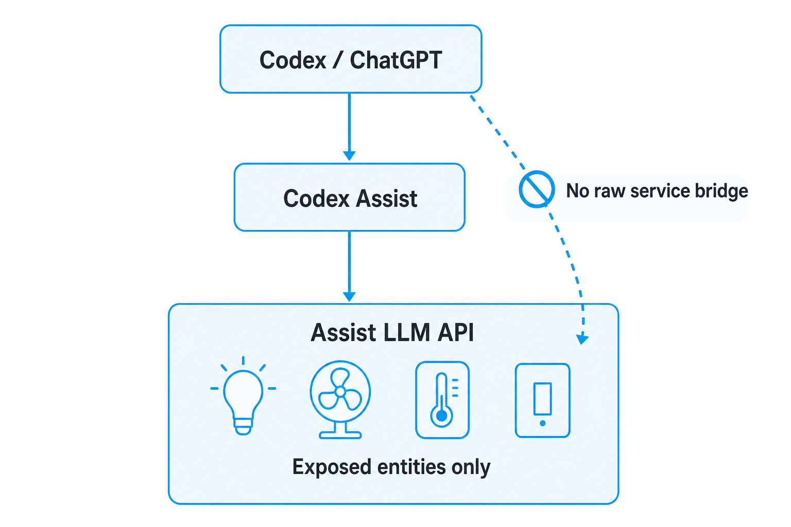

# Security Policy

## Supported versions

Codex Assist is experimental pre-1.0 software. Security fixes are applied to the latest release only.

## Reporting a vulnerability

Please do not open a public issue containing credentials, tokens, cookies, Home Assistant secrets, private URLs, or private logs.

Use GitHub's private vulnerability reporting / security advisory flow if it is available for this repository. If private reporting is not available, contact the repository maintainer privately before sharing sensitive details.

Include:

- Home Assistant version
- Codex Assist version or commit
- a minimal description of the issue
- redacted logs or reproduction steps

Do not include raw access tokens, refresh tokens, device codes, cookies, full Home Assistant config entries, or screenshots containing private URLs.

## Security stance

Codex Assist uses Home Assistant's normal Assist LLM API and exposed-entity controls. It should not add a custom raw service-call bridge or bypass Home Assistant's Assist exposure model.

The important boundary is: Codex / ChatGPT may request an action, but Codex Assist must route that request through Home Assistant's Assist LLM API. Home Assistant then limits execution to the entities exposed to Assist.

## Entity exposure guidance

Only expose entities you intentionally want an Assist conversation agent to read or control.

Be especially careful with:

- locks
- alarms
- garage doors
- covers and gates
- water shutoff valves
- security cameras and security controls
- HVAC modes or setpoints that could create safety or cost issues
- scripts, scenes, buttons, or switches that trigger broad automations

If in doubt, keep the entity unexposed and test with harmless read-only entities or lights first.

## Credential handling

If a Codex / ChatGPT token, Home Assistant token, cookie, device code, or private Home Assistant URL is exposed:

1. revoke or rotate the affected credential;
2. re-authenticate the integration if needed;
3. remove the sensitive material from logs, screenshots, issues, and commits;
4. avoid posting the raw secret in public follow-up discussion.

Codex Assist stores authentication material in Home Assistant's config entry storage. Treat Home Assistant backups, diagnostics, and logs as sensitive unless you have reviewed and redacted them.
