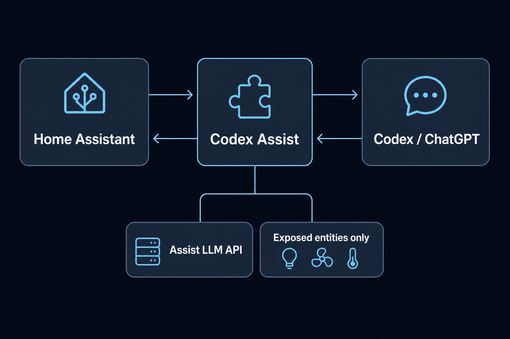

# Architecture

Codex Assist is a Home Assistant custom integration that registers a native Assist conversation agent backed by Codex / ChatGPT access.

## Flow

1. Home Assistant sends a voice/chat request through an Assist pipeline using `conversation.codex_assist`.
2. Codex Assist refreshes its stored Codex/ChatGPT token if needed.
3. Codex Assist sends the conversation to the Codex-compatible service interface.
4. If Codex requests a Home Assistant tool call, Codex Assist maps that request into Home Assistant's Assist LLM API.
5. Home Assistant executes the allowed Assist tool call and returns the result.
6. Codex Assist returns the final response to Home Assistant.

For the security boundary and exposed-entity model, see [../SECURITY.md](../SECURITY.md).

## Upstream compatibility

Codex Assist follows the authentication approach used by the official OpenAI Codex CLI. The downstream Codex service interface is not currently presented as a stable public API contract for third-party Home Assistant integrations, so compatibility may change with upstream Codex updates.
