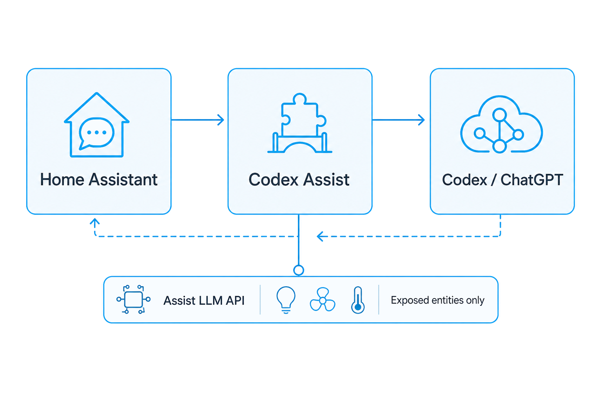

# Architecture

Codex Assist is a Home Assistant custom integration that registers a native Assist conversation agent backed by Codex / ChatGPT access.

## Main components

- **Config flow**: handles Codex-style device-code sign-in, stores OAuth tokens in the Home Assistant config entry, and exposes options such as the selected Codex model.
- **Model discovery**: offers a curated fallback model list and, when authenticated, asks the Codex backend for the currently available model IDs.
- **Conversation agent**: registers `conversation.codex_assist` so Codex Assist can be selected in Home Assistant Assist pipelines.
- **AI Task entity**: registers a native AI Task provider for structured data generation, attachment-aware prompts, and image generation.
- **Runtime token coordinator**: serializes refresh-token rotation per config entry so concurrent Conversation and AI Task requests reuse the winning refresh instead of invalidating one another.
- **Codex client**: sends conversation turns to the Codex-compatible service interface and normalizes its response stream.
- **Hosted web search**: when explicitly enabled, adds the backend `web_search` tool and converts structured URL annotations into a validated source card. Unsupported or unsafe citation URLs are discarded.
- **Assist tool bridge**: maps model-requested actions into Home Assistant's Assist LLM API rather than calling services directly.

## Request flow

1. Home Assistant sends a voice/chat request through an Assist pipeline using `conversation.codex_assist`.
2. Codex Assist refreshes its stored Codex/ChatGPT token if needed.
3. Codex Assist sends the conversation to the Codex-compatible service interface.
4. If Codex requests a Home Assistant tool call, Codex Assist maps that request into Home Assistant's Assist LLM API.
5. Home Assistant validates and executes the allowed Assist tool call using its normal exposed-entity controls.
6. When hosted search is enabled, Codex Assist preserves validated citations in a separate displayed card and instructs the model to keep raw URLs and source blocks out of spoken prose.
7. Codex Assist returns the final response to Home Assistant.

## AI Task flow

1. Home Assistant sends an AI Task request to the Codex Assist AI Task entity.
2. For data-generation tasks, Codex Assist translates instructions and supported attachments into Codex-compatible input items. When Home Assistant supplies a structure, Codex Assist sends it as a native JSON-schema response format, validates the returned data against the same structure, and disables web search so citation text cannot invalidate the JSON result.
3. For image-generation tasks, Codex Assist requests an image from the Codex-compatible service interface using curated quality and size options.
4. Codex Assist returns the structured data or generated image bytes through Home Assistant's native AI Task result types.

Normal Assist conversation surfaces may not expose an upload button even though Home Assistant chat-log objects can carry attachments internally. Native attachment testing should use AI Task surfaces that advertise attachment support.

## Security boundary

Codex / ChatGPT may suggest or request an action, but Home Assistant remains the execution boundary. Device control is routed through Home Assistant's Assist LLM API and limited to entities exposed to Assist.

For the full security stance and exposed-entity guidance, see [../SECURITY.md](../SECURITY.md).

## Intentional non-goals

Codex Assist should not:

- add a custom raw Home Assistant service-call bridge;
- bypass Home Assistant's Assist exposure model;
- require users to expose every entity in their Home Assistant instance;
- run a separate always-on local Codex server;
- store screenshots, device codes, access tokens, refresh tokens, cookies, or private Home Assistant URLs in the repository.

## Upstream compatibility

Codex Assist follows the authentication approach used by the official OpenAI Codex CLI. The downstream Codex service interface is not currently presented as a stable public API contract for third-party Home Assistant integrations, so compatibility may change with upstream Codex updates.
