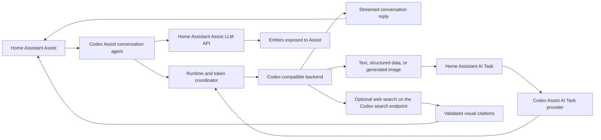

# Architecture

Codex Assist is a Home Assistant custom integration backed by Codex / ChatGPT access. It registers a native Assist conversation agent and a native AI Task provider.

```mermaid
flowchart LR
    Assist[Home Assistant Assist] --> Conversation[Codex Assist conversation agent]
    AITask[Home Assistant AI Task] --> Provider[Codex Assist AI Task provider]

    Conversation --> Runtime[Runtime and token coordinator]
    Provider --> Runtime
    Runtime --> Codex[Codex-compatible backend]

    Conversation --> Bridge[Home Assistant Assist LLM API]
    Bridge --> Exposed[Entities exposed to Assist]

    Codex --> Reply[Streamed conversation reply]
    Codex --> Search[Optional web search on the Codex search endpoint]
    Search --> Citations[Validated visual citations]
    Codex --> TaskResult[Text, structured data, or generated image]

    Reply --> Assist
    Citations --> Assist
    TaskResult --> AITask
```

## Main components

- **Config flow** handles Codex-style device-code sign-in. It stores OAuth tokens in the Home Assistant config entry and exposes integration options.
- **Model discovery** uses only visible model IDs returned for the signed-in account. An entry-scoped, in-memory cache survives temporary failures; a small, explicitly unverified fallback list is used only before a successful result.
- **Conversation agent** registers `conversation.codex_assist` for Home Assistant Assist pipelines.
- **AI Task entity** registers a native provider for text, structured data, supported image attachments, and image generation.
- **Runtime token coordinator** serializes refresh-token rotation per config entry. Concurrent Conversation and AI Task requests reuse the winning refresh instead of invalidating one another.
- **Codex client** sends requests to the Codex-compatible service interface and normalizes its response stream.
- **Native transcript state** retains completed provider output items for stateless replay. The state is deep-copy isolated and remains opaque to normal Home Assistant logs, listeners, and conversation traces, which receive only redacted metadata.
- **Hosted web search** is an explicit option. To avoid reported failures of the built-in search tool on the Codex backend, the client offers a `web_search` function and sends its calls to `alpha/search`, an undocumented endpoint also used by Codex CLI. This is a restricted query/direct-URL adapter, not an implementation of the CLI's complete search protocol. Each `stream_turn` invocation allows at most four search calls across four rounds, then removes the search tool for synthesis; a batch exceeding the remaining call budget or a search call after removal fails explicitly. A Home Assistant tool handoff ends that invocation. Search-only rounds stay inside the client: their text and annotations are withheld from visible output, while their complete ordinary function-call/output history, messages, and reasoning items are retained privately in `CodexNativeState`. That evidence is replayed after an HA tool handoff and on later user turns even when the final answer omits searched facts or URLs. In mixed search and HA rounds, HA tools take priority: search calls are not executed but receive explicit skipped outputs, preserving call/output closure and the round's reasoning. Consequently, search-enabled answer text waits for the round to finish unless an HA tool establishes the handoff. Results use the Home Assistant country setting. The source card lists retrieved top results, not necessarily sources supporting individual claims; unsafe URLs are discarded. Native search-reference continuation and full-page extraction are not promised.
- **Assist tool bridge** maps model-requested device actions into Home Assistant's Assist LLM API. It does not call services directly.

## Assist conversation flow

1. Home Assistant sends a voice or chat request through an Assist pipeline using `conversation.codex_assist`.
2. Codex Assist refreshes its stored Codex or ChatGPT token if needed.
3. Codex Assist sends the conversation to the Codex-compatible backend.
4. If Codex requests a Home Assistant tool call, Codex Assist maps that request into Home Assistant's Assist LLM API.
5. Home Assistant validates and executes the tool call using its normal exposed-entity controls.
6. When hosted search is enabled, Codex Assist keeps validated citations in a displayed card and instructs the model to keep raw URLs and source blocks out of spoken prose.
7. Codex Assist returns the final response to Home Assistant.

For stateless multi-turn requests, Codex Assist keeps completed provider output items in Home Assistant's in-memory chat log and replays them before later user or function-output items. This can include encrypted reasoning state and assistant message phase. The integration does not decrypt that state. Native state is removed from normal delta listeners, uses redacted debug formatting, and serializes as an item count rather than provider content in conversation traces.

Replay keeps whole user turns within the existing 24-item input limit. Older
turns are dropped as complete groups, including their search and HA tool pairs.
If the current turn alone exceeds that limit, the owner fails explicitly rather
than dropping evidence, splitting tool pairs, or stripping reasoning. Search
retention does not implement the CLI's encrypted search-output or ref-ID protocol.

## AI Task flow

1. Home Assistant sends an AI Task request to the Codex Assist AI Task entity.
2. For data-generation tasks, Codex Assist translates the instructions and supported image attachments into Codex-compatible input items.
3. If Home Assistant supplies a structure, Codex Assist sends it as a native JSON Schema response format and validates the returned data against that structure. Hosted web search stays disabled for this path so citations cannot invalidate the result.
4. For image-generation tasks, Codex Assist requests an image using the configured quality and size.
5. Codex Assist returns text, structured data, or generated image bytes through Home Assistant's native AI Task result types.

Normal Assist conversation surfaces may not expose an upload button even though Home Assistant chat-log objects can carry attachments internally. Use AI Task surfaces that advertise attachment support when testing native attachments.

## Model discovery lifecycle

First setup completes device-code sign-in before model selection. Authenticated
discovery is refreshed when options open and every six hours while the entry is
loaded, independently of Assist requests. The periodic callback is cancelled on
unload. Options and periodic discovery resolve and refresh credentials through the
same token coordinator as conversation and AI Task. An HTTP 401 triggers at most
one coordinated refresh and retry.

Each entry caches only model IDs in memory. Results are immutable, concurrent
refreshes are coalesced, successful requests are debounced for 30 seconds, and
failed requests have a 60-second retry backoff. Reauthentication and reconfiguration
clear the cache and invalidate any in-flight result from the previous sign-in.
Successful empty lists remain empty; malformed responses, HTTP errors, and network
failures are distinguished from successful discovery. Cached results and fallback
suggestions are labeled in the form.

The first discovered model in the account’s priority order is preselected for new
setups. Existing models are never changed by discovery:
an absent saved model remains as an explicitly labeled saved choice. The runtime
does not switch models or replay device-control requests after a model rejection.
Image-generation model choices remain a separate curated set. See
[MODEL_DISCOVERY.md](MODEL_DISCOVERY.md) for user-facing behavior.

## Schema conversion compatibility

Assist tool parameters and structured AI Task output use the converter exposed
by Home Assistant's LLM helper. Home Assistant 2026.9 uses Probatio's
`to_openapi`; older supported versions use `convert` from voluptuous-openapi.
Home Assistant 2026.10 no longer exposes a converter on the helper, so Codex
Assist then falls back to `probatio.to_openapi`, which Home Assistant core calls
directly. The helper lookups come first, so an older release with Probatio also
installed still uses its own converter.
The converter must match the helper's serializer and unsupported-value sentinel,
even when both libraries are installed. Home Assistant supplies the matching
library; Codex Assist does not install a separate schema converter.

## Tool-result compatibility

Conversation and AI Task replay share the chat-log conversion path. On HA
2026.10 and newer, it reads `ToolResultContent.result.data`. Older supported
versions expose the same payload as `tool_result`. Codex receives the data
as JSON in `function_call_output`, not the Home Assistant wrapper. Both paths
use Home Assistant's serializer for values such as states and timestamps.

## Security boundary

Codex or ChatGPT may suggest an action, but Home Assistant remains the execution boundary. Device control goes through Home Assistant's Assist LLM API and is limited to entities exposed to Assist.

Prompts, conversation context, supported AI Task attachments, and hosted-search requests leave the Home Assistant instance when the corresponding feature is used. See [../SECURITY.md](../SECURITY.md) for the full data and control boundaries.

## Intentional non-goals

Codex Assist should not:

- add a custom raw Home Assistant service-call bridge;
- bypass Home Assistant's Assist exposure model;
- require users to expose every entity in their Home Assistant instance;
- add a separate attachment-upload service;
- run a separate always-on local Codex server;
- store screenshots, device codes, access tokens, refresh tokens, cookies, or private Home Assistant URLs in the repository.

## Upstream compatibility

Codex Assist follows the authentication approach used by the official OpenAI Codex CLI. The downstream Codex service interface is not presented as a stable public API contract for third-party Home Assistant integrations. Compatibility may change with upstream Codex updates.
